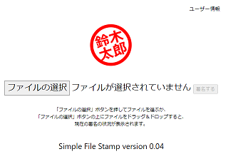
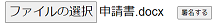
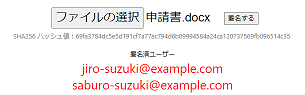

# File Stamp

<!-- TOC depthFrom:1 -->

- [File Stamp](#file-stamp)
- [File Stamp Webアプリケーションを開く](#file-stamp-webアプリケーションを開く)
- [概要](#概要)
  - [署名をする](#署名をする)
  - [署名者の一覧](#署名者の一覧)
  - [署名の取り消し](#署名の取り消し)
- [当サービスの電子署名の信ぴょう性について](#当サービスの電子署名の信ぴょう性について)
  - [目的](#目的)
  - [ファイルの内容の扱い](#ファイルの内容の扱い)
  - [ファイルの内容のハッシュ値](#ファイルの内容のハッシュ値)
  - [署名者の証明方法](#署名者の証明方法)
  - [個人情報の扱い](#個人情報の扱い)
  - [電子署名の扱い](#電子署名の扱い)
  - [無保証](#無保証)
- [File Stamp のシステム構成](#file-stamp-のシステム構成)
  - [User](#user)
  - [Azure Active Directory](#azure-active-directory)
  - [front-react](#front-react)
  - [back-azure](#back-azure)
- [手順メモ（開発者向け）](#手順メモ開発者向け)

<!-- /TOC -->

# File Stamp Webアプリケーションを開く

https://sagep-app-service-v004.azurewebsites.net

**注意** 現在、招待を受けることで、お試しいただくことはできますが、アカウント関連で脆弱性が存在します。
捨てアカウントでお試しください。 

動作の様子を YouTube にアップしました。
[→ Simple File Stamp のデモ動画](https://youtu.be/HHhk-J-gMBs)

File Stamp を使うには、Microsoft アカウントが必要です。
アカウントの作成は、
[Microsoft のホームページ](https://account.microsoft.com/account)
で行ってください。

ユーザーが少ないので、初回のみ起動に時間がかかります。
ページの表示まで（フロントエンド）は 1分20秒、問い合わせ（バックエンド）は 45秒かかります。
2回目の問い合わせは 5秒、3回目以降の問い合わせは 1秒です。

クラウドによるサービスであるため、インターネットにつながる PC やスマートフォンがあれば
どこでも利用できます。

# 概要

## 署名をする

File Stamp は、ファイルの内容に対して承認する印鑑を押すような電子署名を行います。

お使いの PC やスマートフォン（ローカル）にある承認しようとしているファイルを
File Stamp サービス内の「ファイルの選択」ボタンで指定し、
「署名する」ボタンを押すことで、
ファイルの内容に対して承認したことになります。

電子署名に記録される署名者は、
署名ボタンを押したときにサインインしているアカウントに
紐づけられているメールアドレスによって識別されます。
同じメールアドレスが複数のアカウントに紐づけられることはできないため、
アカウントが乗っ取られない限り、なりすましは発生しません。

ファイルの内容は、ファイルのハッシュ値（SHA256）で識別されます。
ファイルの内容を一部でも変更するとハッシュ値が異なる値になるため、
別の書類に印鑑を写すようなことはできません。

署名日も記録されます。

電子署名は、クラウド上のデータベースに保存されます。
データベースに書き込む権限は File Stamp サービスのバックエンドだけなので、
File Stamp サービスのバックエンドが定義した処理以外の方法で
書き換えることはできません。

## 署名者の一覧

電子署名の内容を参照するには、
署名するときと同様に対象となるファイルを指定するだけです。
電子署名の内容は、ファイルの内容に対して署名した人のメールアドレスの一覧です。
電子署名を確認する対象となるファイルを持っている人だけが参照することができます。

## 署名の取り消し

署名者は、承認する印鑑に二重線を付けるように、電子署名を取り消すことができます。
取り消したことはクラウドに保存されます。
一度でも署名したことがあることを削除することはできません。

取り消しの削除（再署名）をすることはできます。

署名日、署名の取り消し日、再署名日のいずれか最も新しい日付のみ記録されます。

# 当サービスの電子署名の信ぴょう性について

## 目的

File Stamp サービスは、ファイルの内容に対して署名者が署名・承認したことを
電子的な署名によって、利害関係のない第三者として証言する Web サービスです。

## ファイルの内容の扱い

ファイルの内容をネットワークに送信するような設計ではないので、
ファイルの内容が漏えいすることはありません。
お使いの PC やスマートフォン（ローカル）のブラウザーの中で
ファイルの内容を元にハッシュ値が計算され、
ハッシュ値のみがクラウド上のサーバーに
HTTPS という暗号化通信を使って送信されます。
ハッシュ値からファイルの内容を知ることは不可能です。

## ファイルの内容のハッシュ値

ファイルの内容は、ファイルのハッシュ値（SHA256）で識別されます。
ハッシュ値のみがクラウド上のサーバーに
HTTPS という暗号化通信を使って送信されます。
ハッシュ値は、ハッシュ関数で計算された 64文字（SHA256の場合）の文字列です。
ハッシュ関数は、ファイルの内容を元に高度な数学によって計算を行います。
ファイルの一部でも変わっていれば値は変わります。
ファイルの内容を一部改ざんして同じハッシュ値が計算されるようにすることは、
確率的に事実上不可能です。
その確率は 2の256乗分の１と言われています。
その確率を下回るようなハッキングが可能であると判明した場合や
ハッシュ値からファイルの内容が類推できると判明した場合、
そのハッシュ関数に脆弱性が見つかったとして、
そのハッシュ関数を使わないようにニュース等で世界中に周知されます。
ハッシュ関数に脆弱性がないかどうかは、多くの研究者によって今でも
検証がされ続けています。

## 署名者の証明方法

File Stamp サービスは、一般的な電子署名のシステムに登場する
デジタル公開鍵証明書を発行する認証局ではありません。
一般の公開鍵証明書には公開鍵と持ち主の記載がありますが、
File Stamp がこの方法によって持ち主であることを証明することはありません。

File Stamp サービスが署名するときは、
アカウントのプロバイダーから提供される
サインイン中のユーザーのメールアドレスが
正しい署名者であるとしてファイルとの関連付けを行っています。
公開鍵は使われませんが、ファイルのハッシュ値、
正しいとされるメールアドレス、それらの紐づけ情報のハッシュ値によって
内容が改ざんされていないことを証明します。

サインイン中のメールアドレスの持ち主を証明するのは、
アカウントのプロバイダーです。
通常、6桁ぐらいのワンタイムのセキュリティーコードを
メールで受け取れる人であるという２段階認証から証明されます。

## 個人情報の扱い

File Stamp サービスは、メールアドレス以外の個人情報を入手しません。
メールアドレスとファイルのハッシュ値のみ参照し、
保護されたデータベースにそれらの紐づけを記録しています。
File Stamp 関係者からメールアドレスを使ってメールを送信したり、
メールアドレスを第三者に提供することはありません。

## 電子署名の扱い

電子署名が保存される場所は、クラウド上のデータベースです。 
データベースに書き込む権限に相当するキーは、
File Stamp サービスのバックエンドが持っています。
バックエンドが定義した処理以外の方法で
書き換えることや参照することができないように、
認証済みのユーザー以外のリクエストを受け付けないように保護されています。
バックエンド自体は、認証済みユーザーが持っている権限以外の処理、
たとえば他のユーザーの署名をすることや
署名を消すこと（取り消しではない）などはできないように作られています。

**注意** 現在、開発中であるため、バックエンドに脆弱性が存在しています。

## 無保証

File Stamp サービスを使ったことで発生した被害については、
当方では補償いたしかねます。

# File Stamp のシステム構成

## User

ユーザーは Microsoft アカウントを持っているものとします。

## Azure Active Directory

Azure Active Directory が Microsoft アカウントの認証を行い、
File Stamp (２つの App Service) にアクセスできるようにします。

双方で相手のクライアントID をチェックしていて、
もしクライアントIDが異なっていたら Web API コールに失敗します。

## front-react

File Stamp のフロントエンドです。
ブラウザーで実行されます。

ブラウザーでファイルのハッシュ値を計算してサーバーの Web API を呼び出します。

- プログラミング言語 JavaScript
- プラットフォーム: React, Node.js

React でビルドしたフロントエンドを Docker でビルドして
ACR (Azure Container Resistry) に登録します。
登録すると App Service が自動的に Docker イメージをプルしてデプロイします。

## back-azure

File Stamp のバックエンドです。
Azure Functions で実行されます。

Cosmos DB を操作します。

- プログラミング言語: C#

Visual Studio のエクステンションで Azure Functions にデプロイします。

# 手順メモ（開発者向け）

- プロジェクトの操作手順
  - [フロントエンド React アプリの steps.yaml](https://github.com/Takakiriy/FileStamp/blob/master/front_react/front_react/steps.yaml)
  - [cypress を使ったフロントエンドのテストの README.md](https://github.com/Takakiriy/FileStamp/blob/master/front_react/test_cypress/README.md)
  - [バックエンド C# 関数の steps.yaml](https://github.com/Takakiriy/FileStamp/blob/master/back_azure/back_azure/steps.yaml)
  - [xUnit を使ったバックエンドのテストの steps.yaml](https://github.com/Takakiriy/FileStamp/blob/master/back_azure/test_xUnit/steps.yaml)
- 一般的な操作手順 
  - [Azure App Service でユーザーをエンド ツー エンドで認証および承認する手順メモ](https://github.com/Takakiriy/Trials/blob/master/try_Azure_E2E_auth/steps.yaml)
  - [App Service へデプロイする手順メモ](https://github.com/Takakiriy/Trials/blob/master/try_Azure_AppService/steps.yaml)
  - [Azure Functions とそのデプロイの手順メモ](https://github.com/Takakiriy/Trials/blob/master/try_Azure_functions_cs/steps.yaml)
  - [Jenkins + Azure AKS の手順メモ](https://github.com/Takakiriy/azure-voting-app-redis/blob/master/steps.yaml)
  - [Azure Functions から SendGrid を使ってメールを送る手順メモ](https://github.com/Takakiriy/Trials/blob/master/try_AzureFunctions_SendGrid/steps.yaml)

手順メモはチュートリアルに書かれていない情報を補足します。
また、チェックリストとしても使える一覧性のある資料です。
YAMLで記述されており、階層表示することができます。
| 操作 | Visual Studio Code での手順 |
| ---- | ------------------ |
| Fold All （すべて折りたたむ） | [Ctrl]+[K], [Ctrl]+[0] |
| Unfold All, Collapse All （すべて開く） | [Ctrl]+[K], [Ctrl]+[J] |
| 子孫ノードを全て開く | > を [Shift]+クリック。Breadcrumbs 内では [Alt]+クリック |
| 子ノードを全て開く（孫は閉じる） | > を [Shift]+２回クリック |
